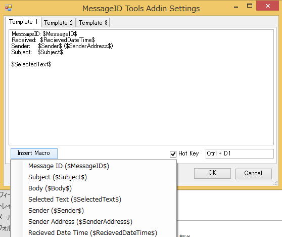

設定画面
==========

テンプレート
--------------

Copy1～3のボタンを押した際、クリップボードにコピーされる内容のテンプレートを指定します。
下記のマクロを使用すると、クリップボードへのコピー時にメールコンテンツに置換されます。

Insert Macro
--------------

選択したマクロがテンプレートに追加されます。

==================  ===============================================
マクロ              説明 
==================  ===============================================
$MessageID$         メールのメッセージIDに置換されます。           
$Subject$           メールの題名に置換されます。                   
$Body$              メールの本文に置換されます。                   
$SelectedText$      メールの選択された文字に置換されます。         
$Sender$            メールの送信者に置換されます。                 
$SenderAddress$     メールの送信者のメールアドレスに置換されます。 
$RecievedDateTime$  メールの受信日時に置換されます。               
==================  ===============================================

Hot Key
---------

チェックをONにすると設定したショートカットキーが有効になります。
