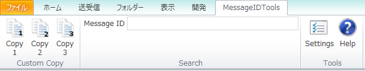

ツールバー
===========

本アドインのメイン機能です。

なお、アイコンはOutlookの機能で配置をカスタマイズできます。

Copy1、Copy2、Copy3
--------------------

Settingsで登録したテンプレートに従って、コンテンツをクリップボードにコピーします。

MessageID 
----------

メッセージボックスにメッセージIDを入力してEnterキーを押すと
メッセージIDを基にメールを検索します。
検索はOutlookの検索機能を使います。
検索を解除すれば、選択状態のままフィルタが解除されますので
前後のメールも見ることができます。

メッセージIDは以下のような形で入力してください。..

    <xxxx@xxxx.xx>

Settings
---------

設定画面を開きます。

Help
-----

ヘルプを開きます。
